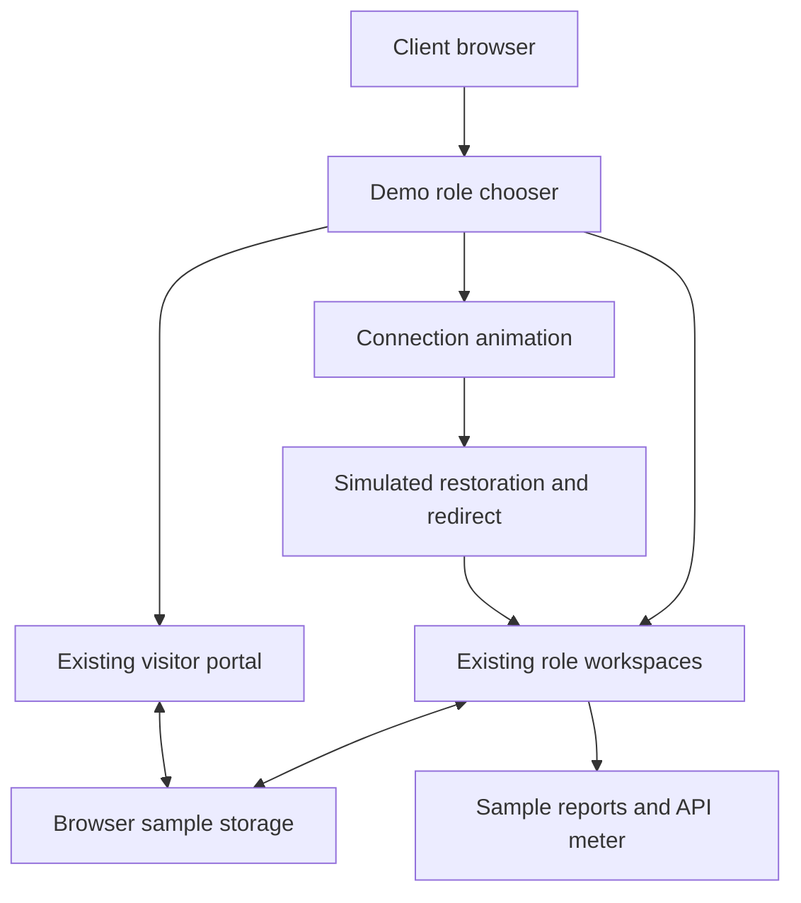

# BrainServe Connect — Client Demo

A separate, browser-only demonstration built from the corrected BrainServe source. Use sample information only.

## Start the ready-to-run package

1. Extract **BrainServe_Client_Demo_Ready.zip** into its own folder.
2. With Node.js 22.13 or newer installed, double-click **START_DEMO.cmd** on Windows. On macOS/Linux, run `node demo/serve.mjs` in that folder.
3. Open **http://127.0.0.1:4180**. Keep the terminal open; Ctrl+C stops the demo.

No `npm install`, database, Java, Docker, Cloudflare, or workerd installation is required for the ready package. Do not double-click `demo-dist/index.html`: the application needs the included local server. If port 4180 is busy, close the other demo; alternatively set `DEMO_PORT` and use the URL printed by the server.

## Present the application

| Step | Workspace | What to show |
|---|---|---|
| 1 | CEO | Overview, visitor occupancy, Reports overview and Explore Records |
| 2 | System Admin | Reports, monthly workforce/visitor register, account lifecycle and governance |
| 3 | Manager → CEO | Approve Rohan Khanna's sample CEO visit in Manager overview; switch to CEO and make the final decision |
| 4 | Reception / Security | Existing sample appointments, arrival details and role-specific visitor controls |
| 5 | HR Admin / Team Lead / Employee | Employee directory, role-specific work, tasks and people workflows |
| 6 | Connection animation | Retry → restoring → redirecting, plus pause/resume controls |

Use **Explore roles** to switch without passwords. Sample changes remain in the same browser profile where the existing preview workflow supports persistence. Reloading returns to the chooser; **Reset demo** clears BrainServe sample storage for this demo origin after confirmation. Other local sites on different ports are separate origins. Avoid opening multiple tabs during a guided demonstration.

The top **Demo guide** explains the scope. **Visitor portal** opens the existing public UI. Portal registration and service-only actions are subject to the existing preview limitations; no email or OTP is sent.

## What is simulated

- All role access is a presentation shortcut, not authentication or authorization.
- Appointments, people, tasks, notifications and local report records use existing browser fixtures.
- CEO and System Admin show an **illustrative API usage meter**. The displayed requests, success rate and latency are fixed sample figures; they do not demonstrate a live telemetry endpoint.
- Connection recovery is a timed presentation of the real recovery component; it performs no outage, session validation or network reconnect.
- No live database, JWT sign-in, email, OTP, Kafka, Redis, S3, malware scanner, or backend export jobs run. Service-only actions can report that the secure backend is required.
- Existing backend access rules are not being validated by this frontend demo. It is not a production deployment package.

## Edit or rebuild from the source package

Extract **BrainServe_Client_Demo_Source.zip** separately from your production working tree. It retains the full corrected application source plus the demo extension.

```sh
npm ci --include=dev --include=optional
npm run demo:build
npm run demo:start
```

For local editing: `npm run demo:dev`. For browser checks: `npx playwright install chromium`, then `npm run demo:test` after building.

`demo:build` uses a standalone Vite/React entry, disables environment-file loading, and fixes the API URL to an empty string. It never imports the production Cloudflare configuration. Fonts, image assets and app scripts are packaged locally. The built HTML restricts outgoing connections with a Content Security Policy. The development server removes this policy only for Vite's local refresh scripts.

Production `npm run build`, `npm test`, backend code, and GitHub Actions remain available in the source package. No GitHub commit, workflow edit or deployment was performed. `demo-dist` is a separate output directory. Do not replace a production deployment with the ready demo: it intentionally includes password-free role previews.

## Files and architecture



The local Node server only serves `demo-dist` assets. It has no database connection, backend proxy or authentication API. A developer can host those assets at the root of a dedicated demo origin, but hosting has not been performed here.

See `DEMO_VERIFICATION.md` for the checks actually run and their limits. The source `README.md` documents the production architecture separately.
