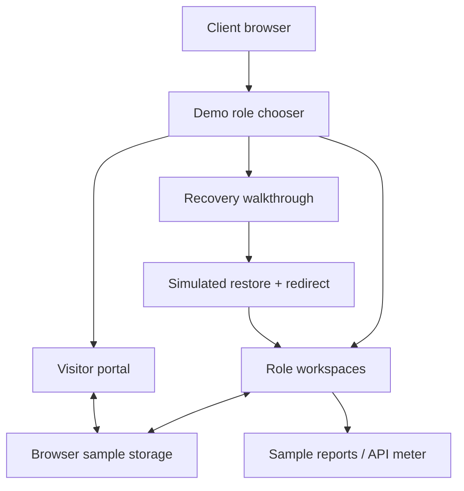

# BrainServe Connect — Client Demo

[](https://brain-serve-connect-vercel-demo.vercel.app/)

This repository is the **client-facing browser demo** of BrainServe Connect.

It is not the production backend hidden behind a nicer README. The demo uses sample browser data so a client can explore the product without a database, passwords, Kafka, Redis, email or OTP infrastructure.

## What you can actually show

| Step | Workspace | Demo path |
|---|---|---|
| 1 | CEO | Overview, visitor occupancy, reports and historical records |
| 2 | System Admin | Reports, workforce/visitor register and account governance |
| 3 | Manager → CEO | Approve the sample Rohan Khanna visit as Manager, then make the final decision as CEO |
| 4 | Reception / Security | Appointments, arrival details and visitor controls |
| 5 | HR Admin / Team Lead / Employee | People, tasks and role-specific work |
| 6 | Recovery flow | Retry → restoring → redirecting, with pause/resume controls |

Use **Explore roles** to move between the eight role workspaces without passwords.

[Open the deployed demo](https://brain-serve-connect-vercel-demo.vercel.app/)

## Why this demo is separate

The real application has infrastructure and access rules that do not belong in a public client walkthrough.

So the demo build:
- uses a separate React/Vite entry
- does not load production environment files
- fixes the API URL to an empty value
- keeps fonts, images and app scripts local
- uses browser fixtures for demo state
- keeps the supplied backend and CI files unchanged

That makes the demo easy to present without pretending it is a production deployment.

## Verification

The demo package was checked on 21 September 2026.

- clean dependency install completed without lockfile changes
- `npm run demo:build` passed
- production `npm test` passed with **263 existing Node tests**
- demo browser suite exited successfully
- **23 browser cases executed**, 3 intentionally skipped
- all eight role workspaces were traversed in desktop and mobile Chromium layouts
- Manager → CEO sample approval flow completed without fetch/XHR calls
- backend files matched the supplied corrected source byte-for-byte
- CI files and package lock remained unchanged

Full evidence: [DEMO_VERIFICATION.md](DEMO_VERIFICATION.md)

## Current friction

The demo is useful, but it is not finished theatre.

- the build still reports a **large JavaScript chunk warning**
- browser verification currently uses **Chromium**; Firefox, WebKit and real mobile devices were not part of this pass
- service-only actions still need the secure backend
- the API meter is illustrative sample data, not live telemetry

Those limits are documented because they matter during a client walkthrough.

## Run the ready demo locally

Node.js 22.13+ is required.

Windows:

```text
START_DEMO.cmd
```

macOS / Linux:

```bash
node demo/serve.mjs
```

Open:

```text
http://127.0.0.1:4180
```

No `npm install`, database, Java or Docker is needed for the ready package.

## Rebuild from the source package

```bash
npm ci --include=dev --include=optional
npm run demo:build
npm run demo:start
```

For local editing:

```bash
npm run demo:dev
```

Browser checks:

```bash
npx playwright install chromium
npm run demo:test
```

## Demo shape



## What is not running here

No live database, Java backend, JWT sign-in, SMTP, OTP delivery, Kafka, Redis, S3, malware scanning, backend export jobs or live telemetry.

For the full walkthrough and presentation notes, read [CLIENT_DEMO.md](CLIENT_DEMO.md).
