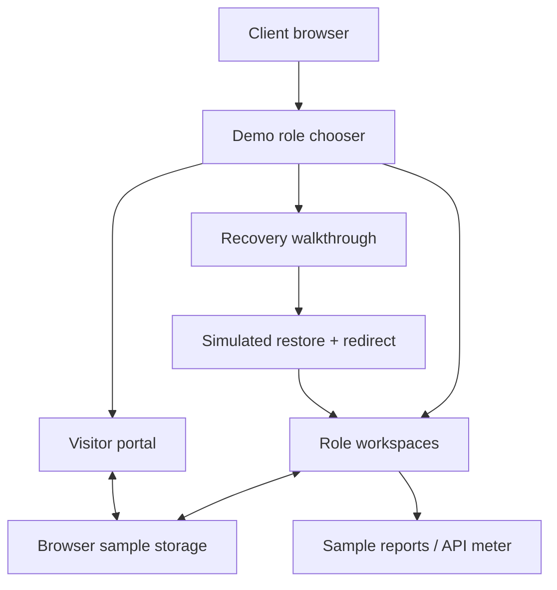

# BrainServe Connect — Enterprise Visitor & Workforce Management Platform

[](https://brain-serve-connect-vercel-demo.vercel.app/)

BrainServe Connect is an enterprise platform for **visitor management, employee operations, departmental workflows and internal communication**.

The application uses seven-role RBAC for **System Admin, CEO, HR Admin, Team Lead, Employee, Receptionist and Security**, with role-specific dashboards and approval flows.

This repository contains the **public client demo**. It presents the product using browser sample data so clients can explore the workflows without exposing the production backend or credentials.

## Core platform workflows

### Visitor lifecycle

`Security intake → Reception verification → HR review → Team Lead / Employee / CEO approval → QR visitor pass → check-in / completion`

### Workforce operations

- department-based employee onboarding
- Team Lead assignment
- task worksheets and progress tracking
- HR insights and CEO audit approval
- account approval and password recovery
- profile management and employee termination approval
- audit trails and permanent operational logs

### Backend architecture

The production system uses:

- Java 21
- Spring Boot 3
- Spring Security
- Spring Data JPA
- PostgreSQL
- Apache Kafka
- Redis
- Flyway
- Maven
- Docker
- REST APIs

Kafka supports internal calls and real-time workflow notifications. PostgreSQL stores authoritative business data, Redis supports fast operational state, and Flyway controls database migrations.

Spring Security, BCrypt password hashing, RBAC, validated state transitions and server-side access restrictions protect the backend flows.

## Public demo

[Open the deployed demo](https://brain-serve-connect-vercel-demo.vercel.app/)

The demo lets a client walk through the major workspaces and workflows without a live database or production authentication.

| Step | Workspace | Demo path |
|---|---|---|
| 1 | CEO | Overview, visitor occupancy, reports and historical records |
| 2 | System Admin | Reports, workforce/visitor register and account governance |
| 3 | Manager → CEO | Approve the sample visitor flow and complete the final decision |
| 4 | Reception / Security | Appointments, arrival details and visitor controls |
| 5 | HR Admin / Team Lead / Employee | People, tasks and role-specific work |
| 6 | Recovery flow | Retry → restoring → redirecting, with pause/resume controls |

Use **Explore roles** to switch between demo workspaces without passwords.

## Why the demo is separate

The public walkthrough is intentionally isolated from the production infrastructure.

The demo build:
- does not load production environment files
- does not expose production authentication or authorization
- uses browser fixtures for sample data
- keeps the supplied backend and CI files unchanged
- can be presented without a database, Kafka, Redis, email or OTP infrastructure

## Demo verification

The client-demo package has its own verification evidence.

- clean dependency installation completed without lockfile changes
- `npm run demo:build` passed
- production `npm test` passed with **263 existing Node tests**
- demo browser suite exited successfully
- **23 browser cases executed**, with 3 intentionally skipped
- all role workspaces were traversed in desktop and mobile Chromium layouts
- backend files matched the supplied corrected source byte-for-byte
- CI files and package lock remained unchanged

Full evidence: [DEMO_VERIFICATION.md](DEMO_VERIFICATION.md)

## Current demo limits

- this public deployment is not the live production backend
- the current build reports a large JavaScript chunk warning
- the latest browser verification is Chromium-based
- service-only operations still require the secure backend
- the API meter is illustrative sample data, not live telemetry

## Run the ready demo locally

Node.js 22.13+ is required.

Windows:

```text
START_DEMO.cmd
```

macOS / Linux:

```bash
node demo/serve.mjs
```

Open:

```text
http://127.0.0.1:4180
```

No database, Java runtime or Docker stack is required for the ready browser demo.

## Rebuild the demo

```bash
npm ci --include=dev --include=optional
npm run demo:build
npm run demo:start
```

For local editing:

```bash
npm run demo:dev
```

Browser checks:

```bash
npx playwright install chromium
npm run demo:test
```

## Demo-only runtime shape



## What is not running in the public demo

No live production database, Java backend, JWT sign-in, SMTP, OTP delivery, Kafka, Redis, S3, malware scanning, backend export jobs or live telemetry.

For the guided presentation flow, read [CLIENT_DEMO.md](CLIENT_DEMO.md).
